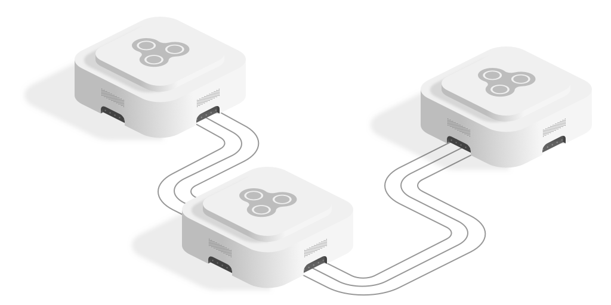

# INTER-CONNECTIBILITY

a service is called (in the context of this document) **inter-connectible** if it provides its public API 
in the same manner that CONNECT instances do. services that are **inter-connectible** can be connected 
to via CONNECT-platform's services feature, which allows them to automatically add wrapper nodes for each public end-point
of the service, making using this services within the platform extremely convenient. additionally we also believe 
(firmly, no kidding) that this is a nice format for communicating logical micro-service APIs (in a little bit higher level
and hence more human readable format than alternatives at least).

## location

the public API should be accessible on `/api` sub-path of the root URL of the service. for example, if the service is to be accessible via `https://example.io`, then the API should be  via `https://example.io/api`. the term **root URL** here simply means the addresses of all end-points of the API should be sub-paths of this URL, so for example if the root URL of your service is 
 ```
 https://another.example.io/some/arbitrary/sub-path/
 ```
 
then the api should be accessible on
```
https://another.example.io/some/arbitrary/sub-path/api
``` 

and the absolute address of all of the end-points should start with 
```
https://another.example.io/some/arbitrary/sub-path/
```

## format

### general

the public API should be in a simple, plain JSON text format (i.e. text that is written in compliance with JSON format). to be more specific, it should be a JSON array containing the signatures of all of the publicly available end-points. it should be returned in response to `GET` requests to the `/api` address.

this is an example of proper response:

```JSON
[
  {
    "path": "/",
    "public": true,
    "outputs": ["msg"]
   }
]
```

which means there is an end-point accessible on the root URL of the service, which requires no inputs and provides a JSON object with a key `msg` as an output. more on that in the following section.

in the following sections, optional and mandatory fields of each signature objects will be outlined, alongside the behaviour or characteristics of the respective endpoint they should be indicative of.

### `"path"`

each signature object should include a path, which is the path at which the end-point is accessible. the path should be relative to the **root URL** of the service. so for example, for a service located at `https://example.com/stuff/`,
if the response to get requests to `https://example.com/stuff/api` is like this:

```JSON
[
  {
    "path": "/",
    "public": true,
    "outputs": ["msg"]
   },
   {
    "path":"/hellow",
    "public": true,
    "inputs": ["to"],
    "outputs": ["greet"],
   }
]
```

then this service should avail two end points on `https://example.com/stuff/` and `https://example.com/stuff/hellow`.

paths are main identifiers of each signature (and subsequently the endpoint they represent), so the `path` property of each signature object should be distinct.

#### parametric paths

end-points can also mark parametric paths. for example, a path marked as `https://example.com/stuff/send/:something/to/:someone` is a path with two parameters: `something` and `someone`, and the same end-point should be responding to all of the following paths:

* `https://example.com/stuff/send/regards/to/that-dude`
* `https://example.com/stuff/send/gratitude/to/42`
* `https://example/com/stuff/send/903284-09234/to/null`
* ...

the parameters in the url should be also included in the `inputs` part of the signature of the end-point. see [inputs section](#inputs-optional) for more information.

### `"public"` [optional]

indicates whether this endpoint is to be accessible publicly or not. for endpoints exposed to the public this field usually does have a `true` value, so it is entirely optional.

### `"method"` [optional]

the http method to be used when requesting this endpoint. can be one of `get`, `put`, `post` and `delete`. if not provided, `get` will be assumed. note that this is just to mark with which http method the endpoint should be invoked and is not to be considered part of the identifier of the signature or the endpoint, i.e. there should not be two signatures with the same path and different methods in the same api response.

method should also generally be indicative of properties of the endpoint, however these characteristics are recommendations and not part of this specification:
- `get` endpoints should just read some state. they should not mutate any state and instantly subsequent invokations of them should have the same result. the response usually should be some data.
- `put` endpoints should modify the state. instantly subsequent invokations of them should yield the same result. the response usually should be status report (done or failed).
- `post` endpoints should append to the state. instantly subsequent invokations of them should yield different results. the response usually should be identifiers that can later be utilized via `put`, `delete` and `get` methods to  to modify the appended part of the state.
- `delete` endpoints should delete from the state. instantly subsequent invokations of them should yield the same result. the response usually should be status report (done or failed).

example:

```JSON
[
  {
    "path": "/remember",
    "public": true,
    "method": "put",
    "inputs": ["the_name"],
    "controlOutputs": ["done", "failed"]
  },
  {
    "path": "/forget",
    "public": true,
    "method": "delete",
    "inputs": ["the_name"],
    "controlOutputs": ["done", "could_not_remember_in_the_first_place", "failed"]
  },
  {
    "path": "/add-note",
    "public": true,
    "method": "post",
    "inputs": ["the_name", "note"],
    "outputs": ["note_number"],
    "controlOutputs": ["do_not_know_that_name", "failed"]
  },
  {
    "path": "/recall",
    "public": true,
    "method": "get",
    "inputs": ["the_name"],
    "outputs": ["notes"],
    "controlOutputs": ["do_not_know_that_name", "failed"]
  }
]
```

### `"inputs"` [optional]

this field should contain a list of strings, each marking the name of an input data that the endpoint requires for operation. these should be the required and sufficient inputs, i.e. the endpoint should require all of these inputs to operate and providing all of these inputs should suffice for the endpoint to operate.

these inputs might be provided in various different manners based on the endpoint's method, and the endpoint should extract them from request data accordingly:
- `get` and `delete` end-points should extract the input data from query parameters,
- `post` and `put` end-points should extract the input data from request body.

in case of parametric paths, regardless of request method, third-party end-points should extract the data from the route itself and not from aforementioned places. for example, imagine we have an end-point with the following signature:

```JSON
{
  "path": "/something/:paramA/",
  "public": true,
  "method": "get",
  "inputs": ["paramA", "paramB"],
  "outputs": ["out"]
}
```

which is part of an api served on `https://example.com/stuff/`. the end-point should operate correctly with a request to the following URL:

```
https://example.com/stuff/something/X/?paramB=Y
```

and it should operate assuming `paramA` is set to `X` and `paramB` is set to `Y`.

### `"outputs"` [optional if `"controlOutputs"` is specified]

should outline list of possible main keys for data responses, each indicating the nature of data being transmitted. responses from end-points of interconnectible micro-services should either be in form of a JSON object, including one main key, which should hold the main data, or in form of a control respones in case only a status flag is being responded without any computed data (see [this section](#controloutputs-optional-if-outputs-is-specified)). for example, the following are all valid data responses:

```JSON
{
  "result": 2
}
```
(in which the main key is `result`),

```JSON
{
  "auth": {
    "success": true,
    "user": {
      "name": "John Doe",
      "email": "john@doe.com"
    },
    "token": {
      "value": "asoijdAWDJ90u8da;OIAD",
      "expiresIn": "3600"
    }
  }
}
```
(in which the main key is `auth`)

```JSON
{
  "error": {
    "code": "403",
    "message": "wrong token provided"
  }
}
```
(in which the main key is `error`)

in each data response object, exactly one of the keys specified in the `outputs` field of the end-point's signature should appear. the object can bear additional keys but they should not be mandatory for utilizing the response data, i.e. if the recipient party ignores all keys but the main key nothing should break.

for example, for an end-point with the following signature:

```JSON
{
  "path": "/",
  "outputs": ["list", "error"]
}
```

the following are valid responses:

```JSON
{
  "list": ["A", "B", { "x" : 3 }]
}
```

```JSON
{
  "error": 500
}
```

but the following are not:

```JSON
["A", "B", {"x": 3}]
```
(because the response is not an object)

```JSON
{
  "status": 200,
  "the-list": ["A", "B", { "x": 3 }]
}
```
(because the response object does not contain any of the keys specified in `outputs`)

```JSON
{
  "list": [],
  "error": 500
}
```
(because the response object contains more than one of the keys specified in `outputs`).

### `"controlOutputs"` [optional if `"outputs"` is specified]

in case an end-point does not want to transmit any data, it can opt to respond with a single string specifying the result status. this is specially useful for end-points supposed to perform a specific operation and report the status of the operation, or when the status of a specific state is to be checked. in that case, all such possible strings should be specified in `controlOutputs` key of the signature. for example, the node with the following signature

```JSON
{
  "path": "/do-something/",
  "method": "post",
  "controlOutputs": ["done", "not_authorized"]
}
```

both `done` and `not_authorized` are valid responses, but `internal_error` or `403` are not.

end-points can have both `outputs` and `controlOutputs`, in which case they can respond either with a JSON object containing exactly one of the keys specified in `outputs` or with one of the strings from the specified list of `controlOutputs`. for example, for an end-point with the following signature

```JSON
{
  "path": "/read/:articleId",
  "method": "get",
  "inputs": ["token", "articleId"],
  "outputs": ["full-article", "article-preview"],
  "controlOutputs": ["not_authorized", "not_found"]
}
```
all of the following are valid responses:
```JSON
{
  "full-article": {
    "title": "Click-bait Title Implying The Author Is Smart And Knows Stuff",
    "author": {
      "name": "John Doe",
      "email": "john@doe.com"
    },
    "body": "This is the full text of the article, so that you can read it and enjoy it and what not."
  }
}
```
```JSON
{
  "article-preview": {
    "title": "Click-bait Title Implying The Author Is Smart And Knows Stuff",
    "author": {
      "name": "John Doe",
      "email": "john@doe.com",
    },
    "body": "This is just a preview of the article's text because you are not a paid user."
  }
}
```
```JSON
not_authorized
```

### `"hints"` [optional]

can be used as a *hinting* or *documentation* mechanism to outline some hints as to how to use the end-point. should be a JSON object, with some of the following keys:

#### `"node"`

should be a human-readable string (or an HTML snippet) generally explaining what this end-point does and how it should be treated.

example:

```JSON
{
  "path": "/something",
  "outputs": ["msg"],
  "hints": {
    "node": "a dummy signature that serves merely as an example of how hints work."
  }
}
```

#### `"inputs"`

should outline hints on each input, what they generally mean and what they should be, etc. should be a JSON object with its keys being possible inputs of the end-point specified in `inputs` field of the signature itself (see [this section](#inputs-optional). the value for each key should be some human readable text (or HTML snippet) about the corresponding input.

example:

```JSON
{
  "path": "/something",
  "inputs": ["a", "b"],
  "outputs": ["something"],
  "hints": {
    "node": "does nothing really.",
    "inputs": {
      "a": "is a really <b>important</b> piece of input",
      "b": "it is not that important but still <i>mandatory</i>. should be a number between 37 and 42."
    }
  }
}
```

#### `"outputs"` and/or `"controlOutputs"`

similar to [`"inputs"`](#inputs), you can add hints for outputs and/or control outputs, explaining what each output means, etc.

example:

```JSON
{
  "path": "/read/:articleId",
  "method": "get",
  "inputs": ["token", "articleId"],
  "outputs": ["full-article", "article-preview"],
  "controlOutputs": ["not_authorized", "not_found"],
  "hints": {
    "node": "loads the specified article for reading.",
    "inputs": {
      "token": "the reader's auth token",
      "articleId": "the id of the article to be loaded"
    },
    "outputs": {
      "full-article": "will contain full article data. only premium readers will get that.",
      "article-preview": "will contain a preview of the article, for non-premium readers."
    },
    "controlOutputs": {
      "not_authorized": "will be sent when the auth token is corrupt or is missing.",
      "not_found": "will be sent when no article with given id can be found."
    }
  }
}
```
